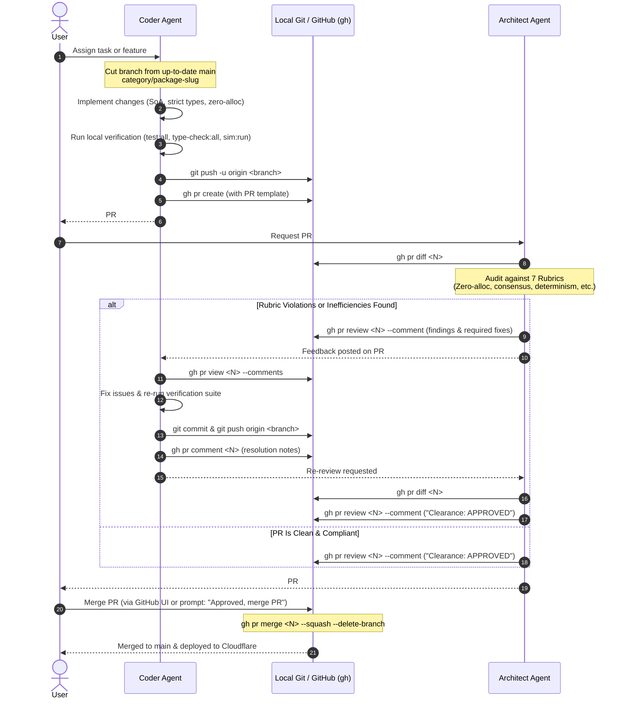

# Chaos Garden Branching Strategy & Agent PR Review Protocol

This document defines the official Git branching strategy, multi-agent Pull Request lifecycle, and review protocols for the `Chaos Garden` repository.

---

## 1. Overview & Philosophy

The Chaos Garden repository maintains a continuous-deployment trunk (`main`) backed by Cloudflare Workers and Cloudflare Pages. To guarantee stability, performance envelopes (zero-allocation hot loops), and distributed consensus safety:

1. **`main` is protected**: Direct pushes to `main` are strictly forbidden for both agents and automated tools.
2. **Every change enters via Pull Request**: All modifications originate on scoped feature branches and merge to `main` only after passing automated test gates, an architectural audit, and human user approval.
3. **Multi-Agent Separation of Concerns**:
   - The **Coder Agent** crafts implementations, verifies tests locally, pushes to feature branches, and opens PRs.
   - The **Architect Agent** performs rigorous audits against the repository's 7 architectural rubrics and leaves structured comments on the PR via the GitHub CLI (`gh`).
   - The **Coder Agent** addresses the review feedback and pushes updates.
   - The **Architect Agent** issues an official architectural clearance sign-off.
   - The **User** gives final approval, triggering a squash merge and automated branch cleanup.

---

## 2. Branch Taxonomy & Naming Conventions

All branches are cut from the latest `origin/main` using this standard naming schema:

```
<category>/<package>-<slug>
```

### Components:
- **`<category>`**: Purpose of the branch.
  - `feat`: New capability, creature behavior, shader, or HUD feature.
  - `fix`: Bug fix, numerical instability resolution, or crash fix.
  - `refactor`: Structural improvement without changing external behavior.
  - `perf`: Memory optimization, zero-allocation pooling, or GPU draw call reduction.
  - `test`: Adding or refining test suites and invariant verifiers.
  - `docs`: Documentation, agent instructions, or architecture diagrams.
  - `chore`: Dependency updates, tooling, or repository maintenance.
- **`<package>`**: Primary monorepo package affected (`shared`, `engine`, `workers`, `client`, or `repo` for cross-cutting changes).
- **`<slug>`**: 2–4 lowercase words separated by hyphens describing the change.

### Examples:
- `feat/engine-spatial-hash-opt`
- `fix/workers-curator-lease-ttl`
- `perf/engine-soa-stride-pack`
- `feat/client-audio-soundscape`
- `docs/repo-branching-strategy`

---

## 3. The Multi-Agent PR Lifecycle



---

## 4. Step-by-Step Command & Role Protocols

### Phase 1: Branch Creation & Implementation (Coder)

1. **Synchronize with `main`**:
   ```powershell
   git checkout main
   git pull origin main
   ```
2. **Create feature branch**:
   ```powershell
   git checkout -b feat/engine-spatial-hash-opt
   ```
3. **Implement changes** adhering strictly to [`docs/agents/coder.md`](coder.md).
4. **Run mandatory verification gate**:
   ```powershell
   npm run type-check:all
   npm run test:all
   npm run sim:run -- --seed=42 --ticks=500 --headless
   ```
5. **Commit with present-tense message**:
   ```powershell
   git add <modified-files>
   git commit -m "feat(engine): optimize spatial hash grid zero-allocation neighbor query"
   ```

### Phase 2: Push & Open Pull Request (Coder)

1. **Scoped Push Authorization**:
   The Coder agent is explicitly permitted to push to its dedicated feature branch (`feat/*`, `fix/*`, etc.). Pushing to `main` is strictly forbidden.
   ```powershell
   git push -u origin feat/engine-spatial-hash-opt
   ```
2. **Create PR via GitHub CLI**:
   ```powershell
   gh pr create --base main --head feat/engine-spatial-hash-opt --title "feat(engine): optimize spatial hash grid zero-allocation neighbor query" --body "## Description`n...`n`n## Coder Verification`n- [x] type-check:all`n- [x] test:all`n- [x] sim:run"
   ```

### Phase 3: Architectural Audit & Review Comments (Architect)

1. **Inspect PR Diff**:
   ```powershell
   gh pr diff <PR_NUMBER>
   ```
2. **Evaluate against the 7 Architectural Rubrics**:
   - [ ] **Zero-Allocation**: No allocations/spreads in 60 FPS loops.
   - [ ] **Main-Thread Decoupling**: Heavy math stays in Web Worker.
   - [ ] **Consensus Safety**: D1 writes guarded by Curator leases/heartbeats.
   - [ ] **Trophic Order Invariance**: `plant (55) < herbivore (65) < carnivore (75)`.
   - [ ] **PRNG Determinism**: Mulberry32 seeded RNG; zero unseeded `Math.random()`.
   - [ ] **Battery/Thermal Throttling**: Steps down to 5 TPS on tab blur.
   - [ ] **Offline Resilience & Cost**: Graceful D1 fallback; preserves $0/mo Cloudflare envelope.
3. **Submit Review**:
   - If changes or fixes are required:
     ```powershell
     gh pr review <PR_NUMBER> --comment --body "### 🏛️ Architect Audit Findings`n`n- **Zero-Allocation**: ⚠️ `SpatialHashGrid.ts:42` allocates a new array inside query(). Please switch to pre-allocated index buffer.`n- **Determinism**: ✅ Verified seeded PRNG.`n...`n`n**Action Required**: Please update the implementation and push fixes."
     ```
   - If clean on first pass: Proceed directly to Phase 5.

### Phase 4: Feedback Resolution (Coder)

1. **Read comments**:
   ```powershell
   gh pr view <PR_NUMBER> --comments
   ```
2. **Apply corrective changes** on the local branch.
3. **Re-run verification gate** (`npm run type-check:all`, `npm run test:all`).
4. **Commit and push**:
   ```powershell
   git add <modified-files>
   git commit -m "fix(engine): reuse contiguous index buffer to eliminate query allocation"
   git push origin <branch_name>
   ```
5. **Post resolution comment**:
   ```powershell
   gh pr comment <PR_NUMBER> --body "Addressed Architect review feedback in commit `<commit_sha>`. Allocations eliminated and verified with Vitest."
   ```

### Phase 5: Architectural Clearance Sign-Off (Architect)

1. **Inspect updated diff**:
   ```powershell
   gh pr diff <PR_NUMBER>
   ```
2. **Submit formal clearance**:
   ```powershell
   gh pr review <PR_NUMBER> --comment --body "### 🏛️ Architectural Clearance: APPROVED`n`nAll 7 architectural rubrics are satisfied. Zero-allocation invariants and determinism verified clean.`n`nReady for final User review and merge."
   ```
3. **Notify User**:
   Alert the user that the PR is fully verified, audited, and ready for merge.

### Phase 6: Final User Approval & Squash Merge

1. **Approval**:
   The user can either:
   - Click **Squash and Merge** on GitHub web UI.
   - Or prompt the agent: `"Approved, merge PR #<N>"`.
2. **Execution via Agent (when prompted by user)**:
   ```powershell
   gh pr merge <PR_NUMBER> --squash --delete-branch
   ```
3. **Local Cleanup & Synchronization**:
   ```powershell
   git checkout main
   git pull origin main
   ```

---

## 5. Non-Negotiable Safety Rules

1. **`main` Direct Push Prohibition**: No agent or script is ever allowed to run `git push origin main`.
2. **Scoped Push Scope**: `git push` is authorized ONLY for active feature branches (`feat/*`, `fix/*`, `perf/*`, etc.) to create/update PRs.
3. **Merge Authorization**: Agents must NEVER merge a PR without the user's explicit confirmation or prompt.
4. **Branch Deletion**: Feature branches are deleted on GitHub upon merge to prevent stale branch accumulation.
