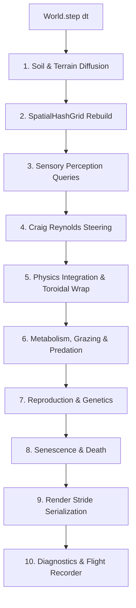

# Phase 2 Design Specification: Standalone ECS Simulation Engine (`@chaos-garden/engine`)

**Role**: System Architect  
**Package**: `@chaos-garden/engine`  
**Status**: Ready for Implementation  
**Dependencies**: `@chaos-garden/shared` (v2.0.0)

---

## 1. System Objectives & Architectural Boundaries

The goal of **Phase 2** is to build a modular, high-performance, deterministic, zero-dependency biological simulation engine. The engine must adhere strictly to these architectural boundaries:

1. **Framework Agnostic**: Pure TypeScript with zero runtime DOM or browser dependencies. Can execute seamlessly inside a Web Worker, a Node.js process, or headless CI runners.
2. **Zero-Allocation Rule**: Exactly 0 bytes allocated during the continuous 60 TPS simulation loop. All state is held in pre-allocated TypedArrays (`Float32Array`, `Uint32Array`, `Int32Array`).
3. **Deterministic Replayability**: All randomness is routed through the seeded Mulberry32 PRNG.
4. **Decoupled Render Pipeline**: Streams flat binary render strides (`Float32Array`, 32 bytes/entity) to the rendering thread via double-buffered zero-copy transferable buffers.
5. **Observability & Diagnostics**: Built-in 300-tick circular ring buffer (Flight Recorder) and machine-readable JSONL logging for autonomous AI agent inspection.

---

## 2. Package Topology & Workspace Alignment

The root workspace is updated to include all packages under `packages/`:

```
chaos-garden/
├── packages/
│   ├── shared/   # [PHASE 1] Contracts, PRNG, zero-allocation stride & math helpers
│   ├── engine/   # [PHASE 2] Standalone ECS (SoA + Generational Pool), Boids, Soil
│   ├── client/   # [PHASE 3] Vite + Svelte 5 + PixiJS v8 + Web Audio
│   └── server/   # [PHASE 4] Cloudflare Worker + D1 SQLite
```

### Shared Package Enhancements

Before engine bootstrapping, [`@chaos-garden/shared`](../packages/shared/) is augmented with:

- `packEntityFieldsToStride`: Direct scalar packing into flat `Float32Array` buffers without intermediate `EntityRenderData` object allocations.
- In-place mutation vector operations (`addMut`, `subMut`, `scaleMut`, `limitMut`, `normalizeMut`) and scalar distance helpers to eliminate object churn.

---

## 3. ECS Architecture & Memory Management

### Generational Free-List Pooling (`EntityPool.ts`)

Entity lifecycles are managed through an $O(1)$ generational free-list stack:

- `generations: Uint16Array(maxEntities)`
- `freeList: Uint32Array(maxEntities)`
- `denseEntities: Uint32Array(maxEntities)`
- `denseCount: number`

When an organism dies:

1. The dead slot index is swapped with the last dense active entity in `denseEntities` ($O(1)$ compaction).
2. The slot is pushed onto `freeList`.
3. The generation number for that slot increments by 1.

### Struct-of-Arrays (SoA) Storage (`ComponentStorage.ts`)

Component data is stored in contiguous, flat typed arrays dimensioned to `maxEntities` (default 2,000):

| Component Group    | Columns                            | Type           | Purpose                                      |
| :----------------- | :--------------------------------- | :------------- | :------------------------------------------- |
| **Spatial**        | `positionsX`, `positionsY`         | `Float32Array` | Continuous 2D world coordinates              |
|                    | `velocitiesX`, `velocitiesY`       | `Float32Array` | Linear velocity vectors (px/s)               |
|                    | `accelerationsX`, `accelerationsY` | `Float32Array` | Steering force accumulators                  |
|                    | `rotations`                        | `Float32Array` | Heading angles (radians)                     |
| **Vitals**         | `energies`                         | `Float32Array` | Metabolic fuel ($0\text{--}100$)             |
|                    | `healths`                          | `Float32Array` | Physical integrity ($0\text{--}100$)         |
|                    | `ages`                             | `Uint32Array`  | Elapsed survival ticks                       |
|                    | `maxLifespans`                     | `Uint32Array`  | Age limit before senescent decay             |
| **Taxonomy**       | `typeCodes`                        | `Uint8Array`   | 0=Plant, 1=Herbivore, 2=Carnivore, 3=Fungus  |
|                    | `sizes`                            | `Float32Array` | Physical radius                              |
|                    | `pigments`                         | `Float32Array` | Lineage color hue ($0\text{--}360^\circ$)    |
|                    | `generations`                      | `Uint16Array`  | Generational ancestry depth                  |
| **Chromosomes**    | `metabolismRates`                  | `Float32Array` | Metabolic drain efficiency                   |
|                    | `reproductionThresholds`           | `Float32Array` | Energy required to reproduce                 |
|                    | `mutationRates`                    | `Float32Array` | Trait drift probability and scale            |
| **Kingdom Traits** | `photosynthesisRates`              | `Float32Array` | Solar conversion efficiency (Plants)         |
|                    | `seedDispersionRadii`              | `Float32Array` | Germination spread distance (Plants)         |
|                    | `moistureAffinities`               | `Float32Array` | Optimal soil moisture (Plants)               |
|                    | `maxSpeeds`, `maxForces`           | `Float32Array` | Locomotion limits (Herbivores/Carnivores)    |
|                    | `perceptionRadii`, `fleeRadii`     | `Float32Array` | Sensory awareness radii                      |
|                    | `flockingWeights`, `packWeights`   | `Float32Array` | Swarm coordination forces                    |
|                    | `decompositionRates`               | `Float32Array` | Organic breakdown speed (Fungi)              |
| **Identity**       | `idHashes`                         | `Uint32Array`  | 24-bit losslessly packed IEEE-754 ID hashes  |
|                    | `parentIndices`                    | `Int32Array`   | Ancestor lineage pointer (-1 for primordial) |
|                    | `bornAtTicks`                      | `Uint32Array`  | Exact birth tick                             |

---

## 4. Subsystems & Pipeline Execution

Every simulation tick (nominal 60 TPS), [`World.ts`](file:///c:/Users/saadm/Documents/repos/chaos-garden/packages/engine/src/ecs/World.ts) executes systems in strict sequential order:



### 1. Living Soil Grid (`SoilGrid.ts`)

- Matrix size: $100 \times 75$ ($7,500$ cells, $16\text{px}$ cell resolution).
- Scalar fields: `moisture` and `nitrates`.
- Double-buffered explicit 2D Laplacian diffusion with $D_m = 0.04$ ($< 0.25$ Courant-Friedrichs-Lewy stability criterion).
- Toroidal edge wrapping prevents boundary artifact pools.

### 2. Spatial Hash Grid (`SpatialHashGrid.ts`)

- Partitions space into $50 \times 38$ buckets ($32\text{px}$ cell size).
- Zero-allocation linked-list arrays: `cellHead: Int32Array` and `nextEntity: Int32Array`.
- $O(N)$ rebuild each tick, enabling $O(1)$ average neighbor queries.

### 3. Craig Reynolds Steering (`SteeringSystem.ts`)

- Pure scalar arithmetic on SoA columns:
  - **Separation**: $\vec{F}_{\text{sep}} = \sum_{j} \frac{\vec{r}_i - \vec{r}_j}{\|\vec{r}_i - \vec{r}_j\|^2}$
  - **Alignment**: $\vec{F}_{\text{align}} = \bar{\vec{v}}_{\text{flock}} - \vec{v}_i$
  - **Cohesion**: $\vec{F}_{\text{coh}} = \bar{\vec{r}}_{\text{flock}} - \vec{r}_i$
  - **Seeking**: Steering toward nearest edible target.
  - **Fleeing**: Repulsion from perceived predators.
- Clamped by `maxForce` and integrated into velocity.

### 4. Biological Rules & Trophic Invariance (`GeneticsSystem.ts`, `MetabolismSystem.ts`)

- Reproduction thresholds are strictly ordered:
  $$\text{Plant}(55) < \text{Herbivore}(65) < \text{Carnivore}(75)$$
- Energy split: Parents provide $50\%$ of energy to newborn offspring upon reproduction.
- Mutation: Traits drift according to Gaussian distributions centered on parent values.
- Pigment drift: Offspring hue drifts by $\pm 5^\circ$, creating a visual phylogeny map.

### 5. Render Stride Packing (`RenderPackingSystem.ts`)

- Packs active entities directly from SoA columns into a flat `Float32Array` using `packEntityFieldsToStride()`.
- 8 floats per entity: `[ID_HASH, X, Y, ROTATION, SIZE, TYPE, HEALTH_RATIO, ENERGY_RATIO]`.
- Zero intermediate object creation.

---

## 5. Observability & Agent Diagnostics

### Flight Recorder (`FlightRecorder.ts`)

- 300-tick ring buffer recording census timeseries.
- Rolling anomaly detection (extinction warnings, population explosions).
- 1-click export of `DiagnosticSnapshot` for instant LLM diagnosis.

### Headless CLI Runners (`cli/`)

- `npm run sim:run -- --seed=42 --ticks=1000 --headless`: Runs 1,000 headless ticks and outputs performance metrics and population telemetry.
- `npm run audit:sim`: 1-second sanity test verifying that tick duration is $< 2.5\text{ms}$ and physical invariants hold.

---

## 6. Verification Criteria

1. **Zero-Allocation**: No GC heap growth across 10,000 simulation ticks under full load (2,000 entities).
2. **Determinism**: Identical seeds produce identical entity counts and positions after 1,000 ticks across any machine or OS.
3. **Trophic Stability**: Plant populations reproduce before herbivores, herbivores before carnivores, avoiding instant extinction cascades.
4. **Performance**: $\le 2.5\text{ms}$ per tick on single-threaded CPU, easily clearing the $16.6\text{ms}$ budget for 60 TPS.

---

## 7. Coder Implementation Checklist & Progress Tracker

> **Tracking Note**: This checklist is maintained by the **Coder Agent** to track implementation progress across Phase 2. Each task must satisfy strict typing (`strict: true`, zero `any`), deterministic PRNG execution, zero in-loop heap allocations, and comprehensive Vitest coverage.

### Phase 2A: Shared Foundation Enhancements (`@chaos-garden/shared`)

- [x] **In-Place Vector Mutation Math** (`packages/shared/src/math/vector.ts`)
  - [x] Implement `addMut(out: Vector2D, a: Vector2D, b: Vector2D): Vector2D`
  - [x] Implement `subMut(out: Vector2D, a: Vector2D, b: Vector2D): Vector2D`
  - [x] Implement `scaleMut(out: Vector2D, v: Vector2D, scalar: number): Vector2D`
  - [x] Implement `limitMut(out: Vector2D, v: Vector2D, max: number): Vector2D`
  - [x] Implement `normalizeMut(out: Vector2D, v: Vector2D): Vector2D`
  - [x] Implement scalar distance helpers (`distSq(x1, y1, x2, y2)`, `dist(x1, y1, x2, y2)`)
  - [x] Export vector helpers in `packages/shared/src/index.ts`
  - [x] Unit tests in `packages/shared/tests/vector.test.ts`
- [x] **Zero-Allocation Stride Serializer** (`packages/shared/src/math/stride.ts`)
  - [x] Implement `packEntityFieldsToStride(buffer, entityIndex, idHash, x, y, rotation, size, type, healthRatio, energyRatio): void`
  - [x] Export `packEntityFieldsToStride` in `packages/shared/src/index.ts`
  - [x] Unit tests verifying zero-object packing equivalence with `packEntityToStride` in `packages/shared/tests/stride.test.ts`
- [x] **Verification**: Run `npm run test`, `npm run type-check`, and `npm run build` in `packages/shared`

### Phase 2B: Engine Scaffolding & Memory Architecture (`@chaos-garden/engine`)

- [ ] **Package Bootstrap**
  - [ ] Create `packages/engine/package.json` with dependencies on `@chaos-garden/shared`
  - [ ] Configure `packages/engine/tsconfig.json` (`strict: true`, ES2022 / NodeNext)
  - [ ] Configure `packages/engine/vitest.config.ts`
  - [ ] Update root `package.json` workspaces to include `packages/engine` and add engine script shortcuts
  - [ ] Create `packages/engine/src/index.ts` entry point
- [ ] **Generational Entity Pool** (`packages/engine/src/ecs/EntityPool.ts`)
  - [ ] Pre-allocate `generations: Uint16Array(maxEntities)`
  - [ ] Pre-allocate `freeList: Uint32Array(maxEntities)` and initialize free index stack
  - [ ] Pre-allocate `denseEntities: Uint32Array(maxEntities)` and `denseCount: number`
  - [ ] Implement $O(1)$ `allocate(): number` returning dense slot index (-1 on exhaustion)
  - [ ] Implement $O(1)$ `free(index: number): void` with dense array compaction swap and generation increment
  - [ ] Implement `isValid(index: number, generation: number): boolean`
  - [ ] Unit tests in `packages/engine/test/ecs/EntityPool.test.ts` (allocation, recycling, generation bumps, compaction invariant)
- [ ] **Struct-of-Arrays (SoA) Component Storage** (`packages/engine/src/ecs/ComponentStorage.ts`)
  - [ ] Allocate spatial arrays: `positionsX`, `positionsY`, `velocitiesX`, `velocitiesY`, `accelerationsX`, `accelerationsY`, `rotations` (`Float32Array`)
  - [ ] Allocate vitals arrays: `energies`, `healths` (`Float32Array`), `ages`, `maxLifespans` (`Uint32Array`)
  - [ ] Allocate taxonomy arrays: `typeCodes` (`Uint8Array`), `sizes`, `pigments` (`Float32Array`), `generations` (`Uint16Array`)
  - [ ] Allocate chromosome arrays: `metabolismRates`, `reproductionThresholds`, `mutationRates` (`Float32Array`)
  - [ ] Allocate kingdom trait arrays: `photosynthesisRates`, `seedDispersionRadii`, `moistureAffinities`, `maxSpeeds`, `maxForces`, `perceptionRadii`, `fleeRadii`, `flockingWeights`, `packWeights`, `decompositionRates` (`Float32Array`)
  - [ ] Allocate identity arrays: `idHashes` (`Uint32Array`), `parentIndices` (`Int32Array`), `bornAtTicks` (`Uint32Array`)
  - [ ] Implement zero-allocation entity initialization helper `initEntity(index, typeCode, genome, ...)`
  - [ ] Unit tests in `packages/engine/test/ecs/ComponentStorage.test.ts`

### Phase 2C: Environmental & Spatial Partitioning Subsystems

- [ ] **Living Soil Grid** (`packages/engine/src/environment/SoilGrid.ts`)
  - [ ] Dimension grid: $100 \times 75$ ($7,500$ cells, $16\text{px}$ resolution)
  - [ ] Allocate double-buffered flat `Float32Array`: `moistureCurrent`, `moistureNext`, `nitratesCurrent`, `nitratesNext`
  - [ ] Implement explicit 2D Laplacian diffusion step (`diffuse(diffusionRate = 0.04)`) with toroidal wrapping
  - [ ] Implement pointer/buffer swap (`swapBuffers()`) with 0 GC allocations
  - [ ] Implement coordinate-to-cell sampling helpers: `getMoisture(x, y)`, `getNitrates(x, y)`
  - [ ] Implement nutrient modification helpers: `consumeNitrates(x, y, amount)`, `depositNitrates(x, y, amount)`
  - [ ] Unit tests in `packages/engine/test/environment/SoilGrid.test.ts` (conservation of mass, CFL stability, boundary wrap)
- [ ] **Spatial Hash Grid** (`packages/engine/src/spatial/SpatialHashGrid.ts`)
  - [ ] Dimension grid: $50 \times 38$ buckets ($32\text{px}$ cell size)
  - [ ] Allocate zero-allocation linked-list arrays: `cellHead: Int32Array(numBuckets)` and `nextEntity: Int32Array(maxEntities)`
  - [ ] Implement $O(N)$ tick rebuild: `clear()` and `insert(entityIndex, x, y)`
  - [ ] Implement neighbor query: `queryNeighbors(x, y, radius, callback: (neighborIndex: number) => void): void` (zero heap allocations)
  - [ ] Implement fast radial distance filtering within spatial buckets
  - [ ] Unit tests in `packages/engine/test/spatial/SpatialHashGrid.test.ts` (query accuracy, entity distribution, boundary cases)

### Phase 2D: Biological & Physical Simulation Subsystems

- [ ] **Perception & Craig Reynolds Steering** (`packages/engine/src/systems/SteeringSystem.ts`)
  - [ ] Implement separation force ($\vec{F}_{\text{sep}} \propto 1/r^2$ from neighbors within separation radius)
  - [ ] Implement alignment force ($\bar{\vec{v}}_{\text{flock}} - \vec{v}$) and cohesion force ($\bar{\vec{r}}_{\text{flock}} - \vec{r}$)
  - [ ] Implement pursuit/seeking force towards nearest food/prey
  - [ ] Implement evasion/fleeing force away from predators within `fleeRadius`
  - [ ] Implement wandering drift force using deterministic PRNG
  - [ ] Accumulate combined steering force into `accelerationsX`, `accelerationsY` clamped by `maxForce`
  - [ ] Unit tests in `packages/engine/test/systems/SteeringSystem.test.ts`
- [ ] **Physics Integration & Boundary Wrapping** (`packages/engine/src/systems/PhysicsSystem.ts`)
  - [ ] Integrate accelerations into velocities: $v = v + a \cdot \Delta t$, clamped to `maxSpeed`
  - [ ] Integrate velocities into positions: $p = p + v \cdot \Delta t$
  - [ ] Update `rotations` heading angle: $\theta = \operatorname{atan2}(v_y, v_x)$
  - [ ] Apply toroidal coordinate wrapping across `[0, gardenWidth)` and `[0, gardenHeight)`
  - [ ] Clear `accelerationsX` and `accelerationsY` to zero
  - [ ] Unit tests in `packages/engine/test/systems/PhysicsSystem.test.ts`
- [ ] **Metabolism, Grazing & Predation** (`packages/engine/src/systems/MetabolismSystem.ts`)
  - [ ] Apply basal metabolic drain: `energies[idx] -= metabolismRates[idx] * dt`
  - [ ] Plant photosynthesis: absorb solar energy + soil moisture/nitrates
  - [ ] Herbivore grazing: consume nearby plants, transferring energy and damaging/consuming plant entity
  - [ ] Carnivore predation: attack nearby herbivores, transferring energy upon kill
  - [ ] Fungi decomposition: absorb nutrients from organic detritus / corpses and deposit nitrates into `SoilGrid`
  - [ ] Energy depletion check: apply health decay when energy hits 0
  - [ ] Unit tests in `packages/engine/test/systems/MetabolismSystem.test.ts`
- [ ] **Genetics & Reproduction** (`packages/engine/src/systems/GeneticsSystem.ts`)
  - [ ] Enforce trophic reproduction threshold checks: `Plant(55) < Herbivore(65) < Carnivore(75)`
  - [ ] Check population ceilings per kingdom from `SimulationConfig`
  - [ ] Parent energy split: 50% retained by parent, 50% given to offspring
  - [ ] Allocate offspring in `EntityPool` and initialize via SoA
  - [ ] Offspring trait mutation via seeded Mulberry32 PRNG (Gaussian drift around parent traits)
  - [ ] Pigment hue drift ($\pm 5^\circ$) for visual phylogeny lineage
  - [ ] Unit tests in `packages/engine/test/systems/GeneticsSystem.test.ts` (trophic thresholds, energy conservation, mutation drift)
- [ ] **Senescence & Mortality Handling** (`packages/engine/src/systems/MortalitySystem.ts`)
  - [ ] Increment `ages[idx]` each tick
  - [ ] Flag entities for death when `ages[idx] >= maxLifespans[idx]` or `healths[idx] <= 0`
  - [ ] Dead biomass conversion: deposit nitrates into `SoilGrid` at entity coordinate
  - [ ] Deallocate dead slots from `EntityPool` with $O(1)$ dense swap
  - [ ] Unit tests in `packages/engine/test/systems/MortalitySystem.test.ts`

### Phase 2E: World Pipeline Orchestration & Render Serialization

- [ ] **Render Stride Packing** (`packages/engine/src/systems/RenderPackingSystem.ts`)
  - [ ] Pre-allocate double-buffered render strides: `Float32Array(maxEntities * 8)`
  - [ ] Direct SoA extraction to flat buffer using `packEntityFieldsToStride`
  - [ ] Write active entity count and frame metadata
  - [ ] Zero object allocations during stride serialization
  - [ ] Unit tests in `packages/engine/test/systems/RenderPackingSystem.test.ts`
- [ ] **World Orchestrator** (`packages/engine/src/ecs/World.ts`)
  - [ ] Initialize `EntityPool`, `ComponentStorage`, `SoilGrid`, `SpatialHashGrid`, and PRNG with seed
  - [ ] Bootstrap primordial ecosystem entities according to `SimulationConfig`
  - [ ] Implement `step(dt: number): void` strictly following the 10-step execution pipeline
  - [ ] Implement render frame getter / buffer transfer API for Web Worker consumption
  - [ ] Unit tests in `packages/engine/test/ecs/World.test.ts`

### Phase 2F: Observability, Diagnostics & Headless CLI

- [ ] **Flight Recorder Ring Buffer** (`packages/engine/src/diagnostics/FlightRecorder.ts`)
  - [ ] Pre-allocate 300-tick ring buffer arrays for census timeseries (plants, herbivores, carnivores, fungi, avg energy, tick duration)
  - [ ] Implement tick record push without heap allocations
  - [ ] Rolling anomaly detection (extinction warning, population explosion, energy collapse)
  - [ ] JSONL / `DiagnosticSnapshot` export for AI agent inspection
  - [ ] Unit tests in `packages/engine/test/diagnostics/FlightRecorder.test.ts`
- [ ] **Headless CLI Tools** (`packages/engine/src/cli/`)
  - [ ] Create `packages/engine/src/cli/sim.ts` (`npm run sim:run -- --seed=42 --ticks=1000 --headless`)
  - [ ] Create `packages/engine/src/cli/audit.ts` (`npm run audit:sim` verifying sub-2.5ms tick latency and physical invariants)
  - [ ] Wire CLI scripts in `packages/engine/package.json` and root `package.json`

### Phase 2G: Automated Test Suite & Invariant Verification

- [ ] **Zero-Allocation Verification Test** (`packages/engine/test/invariants/zeroAllocation.test.ts`)
  - [ ] Run 10,000 ticks under full load (2,000 entities) in Node.js
  - [ ] Assert zero GC heap growth during steady-state ticks
- [ ] **Determinism Invariant Test** (`packages/engine/test/invariants/determinism.test.ts`)
  - [ ] Run 1,000 ticks with seed `42` twice
  - [ ] Assert bit-identical entity counts, positions, energies, and render strides
- [ ] **Trophic Ordering Invariant Test** (`packages/engine/test/invariants/trophicOrder.test.ts`)
  - [ ] Verify `plant (55) < herbivore (65) < carnivore (75)` reproduction thresholds under all mutations
- [ ] **Performance Benchmark Test** (`packages/engine/test/benchmarks/tickPerformance.test.ts`)
  - [ ] Benchmark average tick time $\le 2.5\text{ms}$ at 2,000 entities
- [ ] **Full Test Suite & Type Check Execution**
  - [ ] `npm run test -w @chaos-garden/engine`
  - [ ] `npm run type-check -w @chaos-garden/engine`
  - [ ] `npm run test:all`
