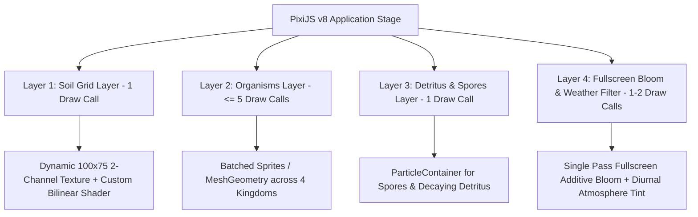
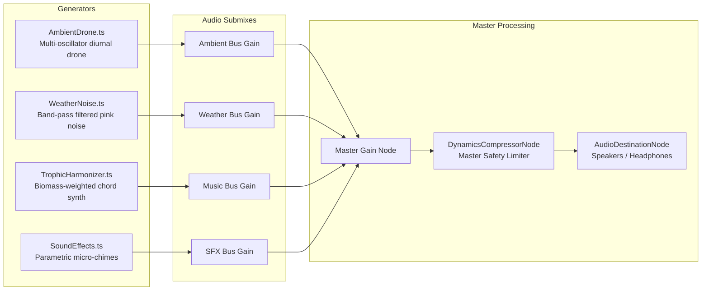

# Phase 3 Design Specification: Client Application (`@chaos-garden/client`)

**Role**: System Architect  
**Package**: `@chaos-garden/client`  
**Status**: Completed  
**Dependencies**: `@chaos-garden/shared` (v2.0.0), `@chaos-garden/engine` (v1.0.0)  
**Target Stack**: Vite 6, Svelte 5 (Runes), PixiJS v8, Web Audio API, Web Workers, Tailwind CSS, TypeScript 5.x

---

## 1. System Objectives & Architectural Boundaries

The goal of **Phase 3** is to build a responsive, visually stunning, hardware-accelerated client application for Chaos Garden. The application transitions the project from a legacy Astro slideshow into a continuous, 60 FPS living terrarium running directly in the browser.

The client application must strictly observe these core architectural boundaries:

1. **Zero-Allocation Render Loop**: The continuous 60 FPS PixiJS render loop must never allocate JavaScript heap objects, arrays, closures, or temporary structs. Entity state is streamed across threads via flat 32-byte `Float32Array` transferable double-buffers (`[ID_HASH, X, Y, ROTATION, SIZE, TYPE, HEALTH_RATIO, ENERGY_RATIO]`).
2. **Main-Thread Decoupling**: The physics and biological ECS simulation runs entirely inside a dedicated Web Worker hosting `@chaos-garden/engine`. The browser main thread is reserved exclusively for PixiJS GPU draw commands, user pointer interaction, and procedural audio synthesis.
3. **Svelte 5 Runes Reactive Decoupling**: Svelte 5 UI components (`$state`, `$derived`, `$effect`) never bind to the 60 FPS tick stream. The Web Worker dispatches a throttled **Telemetry Pulse** at 4–10 Hz (100–250ms intervals). Reactive runes remain idle between pulses, completely eliminating DOM re-renders and framework overhead from the animation frame budget.
4. **Strict GPU Draw-Call Budget ($\le 10$ Total Draw Calls)**:
   - **Living Soil Grid** ($100 \times 75$): Uploaded to a dynamic 2-channel GPU texture with bilinear filtering and rendered via a single custom fragment shader (**1 draw call**).
   - **Bioluminescent Organisms** (up to 2,000 entities): Batched instanced meshes or `ParticleContainer` across all 4 kingdoms (**$\le 5$ draw calls**).
   - **Fullscreen Post-Processing Veil**: Additive bioluminescent bloom and diurnal/weather atmospheric lighting tint (**1–2 draw calls**).
5. **Zero-Asset Generative Web Audio**: The soundscape is 100% procedurally synthesized using native Web Audio API oscillators, biquad noise filters, and parametric envelopes. Zero audio files ($0\text{ MB}$ asset download footprint).
6. **Battery & Thermal Management**: Integrates the Page Visibility API via `VisibilityManager`. When the browser tab is hidden or blurred, the Web Worker steps down from 60 TPS to 5 TPS, the PixiJS render ticker halts, and `AudioContext` suspends, reducing CPU/GPU load to $< 1\%$.
7. **Offline-First Local Resilience**: Bootstraps from Cloudflare D1 (`GET /api/garden`) when online, but falls back gracefully to a local IndexedDB cache or seeded primordial generation if network connectivity is unavailable.

---

## 2. Package Topology & Workspace Alignment

The `@chaos-garden/client` package resides in `packages/client/` within the monorepo workspace:

```
chaos-garden/
├── packages/
│   ├── shared/   # [PHASE 1] Core contracts, vector math, PRNG, binary stride protocol
│   ├── engine/   # [PHASE 2] Standalone ECS (SoA + Generational Pool), boids, soil grid
│   ├── client/   # [PHASE 3] Vite + Svelte 5 (Runes) + PixiJS v8 + Web Audio + Web Worker
│   └── server/   # [PHASE 4] Cloudflare Workers + D1 SQLite (canonical epochs, curator leases)
```

### Directory Structure (`packages/client/`)

```
packages/client/
├── index.html                           # Single-page app root HTML
├── package.json                         # Workspace package configuration & dependencies
├── vite.config.ts                       # Vite 6 config with Svelte 5 plugin & worker bundling
├── svelte.config.js                     # Svelte 5 compiler options (runes mode)
├── tsconfig.json                        # TypeScript configuration (strict: true, DOM + Worker types)
├── tailwind.config.js                   # Glassmorphic bioluminescent theme tokens
├── postcss.config.js                    # PostCSS configuration for Tailwind
├── public/
│   ├── favicon.svg                      # Terrarium favicon
│   └── assets/                          # Static icon assets (minimal SVG)
├── src/
│   ├── main.ts                          # Client entry point: mounts App.svelte
│   ├── App.svelte                       # Master shell: integrates canvas, HUD overlays, modals
│   ├── app.css                          # Tailwind imports, custom glassmorphism & scrollbar styles
│   ├── worker/                          # Web Worker simulation pipeline
│   │   ├── SimulationWorker.ts          # Dedicated Web Worker executing @chaos-garden/engine
│   │   ├── WorkerBridge.ts              # Main-thread controller managing typed RPC & ping-pong buffers
│   │   └── types.ts                     # Inbound/outbound message protocols and transfer contracts
│   ├── renderer/                        # PixiJS v8 hardware-accelerated rendering pipeline
│   │   ├── GardenViewport.ts            # Application setup, DPR scaling, resize observer, render loop
│   │   ├── SoilLayer.ts                 # Dynamic GPU texture & custom bilinear fragment shader
│   │   ├── OrganismLayer.ts             # Batched bioluminescent sprites/meshes (< 5 draw calls)
│   │   ├── AtmosphericVeil.ts           # Fullscreen additive bloom and diurnal/weather lighting tint
│   │   ├── CameraController.ts          # Smooth pan/zoom, bounds clamping, and entity follow-cam
│   │   └── shaders/
│   │       ├── soilShader.ts            # Fragment shader for soil moisture & nitrate gradient
│   │       └── bloomShader.ts           # Post-processing atmospheric bloom & tint filter
│   ├── audio/                           # 100% Procedural Web Audio API soundscape
│   │   ├── ProceduralSoundscape.ts      # AudioContext manager, master bus graph, user gesture unlock
│   │   ├── AmbientDrone.ts              # Diurnal multi-oscillator harmonic chord drone
│   │   ├── WeatherNoise.ts              # Band-pass filtered white/pink noise wind and rain generator
│   │   ├── TrophicHarmonizer.ts         # Procedural harmonic intervals keyed to kingdom biomass
│   │   └── SoundEffects.ts              # Parametric micro-chimes (birth, death, speciation, UI clicks)
│   ├── power/
│   │   └── VisibilityManager.ts         # Page Visibility API throttling (5 TPS blur / 60 TPS focus)
│   ├── storage/
│   │   └── LocalPersistence.ts          # IndexedDB snapshot caching & offline boot fallback
│   ├── state/
│   │   ├── gardenState.svelte.ts        # Global client state powered by Svelte 5 Runes ($state)
│   │   └── curatorState.svelte.ts       # Active tool, mouse world coordinates, selection target
│   └── ui/                              # Svelte 5 reactive glassmorphic UI components
│       ├── components/
│       │   ├── GardenCanvas.svelte         # Canvas container, PixiJS lifecycle, pointer events
│       │   ├── CuratorToolbar.svelte       # Play/Pause, speed scrubber (0.5x–10x), tool dock
│       │   ├── StatsHUD.svelte             # TPS/FPS counters, tick count, population breakdown bars
│       │   ├── EntityInspector.svelte      # Creature vitals, chromosomes, lineage tree card
│       │   ├── ChronicleDrawer.svelte      # Evolutionary milestone timeline drawer
│       │   ├── LlmDiagnosticsModal.svelte  # 1-click LLM clipboard export generator
│       │   └── AudioControls.svelte        # Mute toggle, volume slider, ambiance bus toggles
│       └── shared/
│           ├── GlassPanel.svelte           # Translucent frosted container snippet
│           └── VitalsBar.svelte            # Micro progress bar for energy/health
└── tests/                               # Vitest testing suite
    ├── vitest.config.ts
    ├── worker/WorkerBridge.test.ts
    ├── renderer/GardenViewport.test.ts
    ├── audio/ProceduralSoundscape.test.ts
    ├── power/VisibilityManager.test.ts
    ├── storage/LocalPersistence.test.ts
    └── state/gardenState.test.ts
```

---

## 3. Web Worker Threading & Data Bus Architecture

To guarantee a completely smooth 60 FPS interface without dropped frames during intensive ecological events (such as population explosions or mass die-offs), the simulation engine runs in an isolated Web Worker.

```mermaid
sequenceDiagram
    autonumber
    participant UI as Svelte 5 HUD (Main)
    participant Pixi as PixiJS v8 Viewport (Main)
    participant Bridge as WorkerBridge (Main)
    participant Worker as SimulationWorker (Worker)
    participant Engine as World (@chaos-garden/engine)

    Note over Bridge,Worker: Initialization & Boot
    Bridge->>Worker: postMessage({ type: 'INIT', seed, width, height })
    Worker->>Engine: new World({ seed, config })
    Worker->>Engine: seedPrimordialEcosystem()

    loop 60 FPS Render Loop (Zero-Copy Ping-Pong)
        Worker->>Engine: step(1/60)
        Engine-->>Worker: getTransferableRenderFrame() (Buffer A)
        Worker->>Bridge: postMessage({ type: 'RENDER_FRAME', buffer: Buffer A }, [Buffer A])
        Bridge->>Pixi: updateOrganisms(Buffer A)
        Pixi->>Pixi: app.render() (GPU batched draw)
        Bridge->>Worker: postMessage({ type: 'RETURN_RENDER_BUFFER', buffer: Buffer A }, [Buffer A])
        Note over Worker,Bridge: Buffer A returns to pool; Buffer B alternates
    end

    loop 15 Hz Terrain Stream
        Worker->>Bridge: postMessage({ type: 'SOIL_TEXTURE_UPDATE', moisture, nitrates }, [buffers])
        Bridge->>Pixi: uploadSoilTexture(moisture, nitrates)
    end

    loop 4-10 Hz Throttled Telemetry Pulse
        Worker->>Bridge: postMessage({ type: 'TELEMETRY_PULSE', tps, populations, selectedVitals })
        Bridge->>UI: gardenState.updateFromTelemetry(pulse)
        Note over UI: Svelte 5 Runes ($state, $derived) update HUD
    end

    Note over UI,Worker: Curator Interactive Interventions
    UI->>Bridge: dispatchCuratorAction('WATER_SOIL', { x, y })
    Bridge->>Worker: postMessage({ type: 'CURATOR_ACTION', action, position })
    Worker->>Engine: soil.depositMoisture(x, y, amount)
```

### 3.1 Zero-Allocation Transferable Ping-Pong Pipeline

1. **Stride Layout**: Each entity uses an 8-float slice (32 bytes):
   $$\text{Offset 0: ID\_HASH},\quad \text{Offset 1: POS\_X},\quad \text{Offset 2: POS\_Y},\quad \text{Offset 3: ROTATION},$$
   $$\text{Offset 4: SIZE},\quad \text{Offset 5: TYPE},\quad \text{Offset 6: HEALTH\_RATIO},\quad \text{Offset 7: ENERGY\_RATIO}$$
2. **Double-Buffering**:
   - The worker maintains two pre-allocated `Float32Array` buffers dimensioned to `maxTotalEntities * 8` ($2,000 \times 8 = 16,000$ floats $\approx 64\text{ KB}$).
   - On frame $N$, the worker packs active entities into Buffer A and transfers Buffer A via `postMessage(msg, [bufferA.buffer])`. The worker immediately loses ownership of Buffer A.
   - On frame $N+1$, the worker packs into Buffer B.
   - The main-thread `WorkerBridge` reads Buffer A, uploads its vertex attributes or updates sprite transforms, and immediately returns Buffer A back to the worker via `postMessage({ type: 'RETURN_RENDER_BUFFER', buffer: bufferA.buffer }, [bufferA.buffer])`.
   - **Garbage Collection Cost**: Exactly **0 bytes** allocated per frame on both threads.

### 3.2 Soil Grid Streaming Pipeline

- The $100 \times 75$ soil grid ($7,500$ cells) updates via Laplacian diffusion at 60 TPS in the engine.
- Because soil moisture and nitrates diffuse slowly ($D_m = 0.04$), streaming the terrain at 60 FPS is unnecessary.
- The worker throttles `SOIL_TEXTURE_UPDATE` to **15–20 Hz** (every 3–4 simulation ticks).
- It sends two pre-allocated transferable `Float32Array(7500)` buffers, which are written directly into a dynamic PixiJS texture source.

### 3.3 Throttled Telemetry for Svelte 5 Runes

- Svelte 5 introduces fine-grained reactivity through Runes (`$state`, `$derived`). Updating Svelte reactive signals at 60 Hz would force constant layout and DOM recalculations.
- The worker emits `TELEMETRY_PULSE` at **4–10 Hz** (configurable, default 10 Hz):
  ```typescript
  export interface TelemetryPulse {
    type: 'TELEMETRY_PULSE';
    tick: number;
    tps: number;
    populations: {
      plants: number;
      herbivores: number;
      carnivores: number;
      fungi: number;
      totalLiving: number;
      totalBiomass: number;
    };
    selectedEntityVitals?: SelectedEntityVitals | null;
  }
  ```
- Svelte HUD components bind exclusively to this throttled stream, keeping the main-thread script execution under $1\text{ms}$ per pulse.

---

## 4. Hardware-Accelerated PixiJS v8 Rendering Pipeline

Rendering runs on PixiJS v8 using WebGL with WebGPU fallback readiness. The scene graph is strictly structured into 4 isolated layers to enforce the $\le 10$ draw-call budget:



### 4.1 Layer 1: Living Soil Dynamic Texture (`SoilLayer.ts`)

- **Texture Dimension**: $100 \times 75$ texels matching `SoilGrid` ($16\text{px}$ per texel across $1600 \times 1200$ coordinate space).
- **Format**: `PIXI.Texture.fromBuffer` or custom `BufferImageSource` with `Float32Array` or RGBA pixel buffer:
  - Channel R: Soil Moisture ($0.0 \to 1.0$).
  - Channel G: Decomposed Nitrates ($0.0 \to 1.0$).
  - Channel B: Sunlight / Temperature factor.
  - Channel A: 1.0 (Opaque).
- **Custom Bilinear Fragment Shader (`soilShader.ts`)**:
  - Samples the $100 \times 75$ dynamic texture using bilinear filtering to produce silky, organic contours without pixelation.
  - Maps low moisture/nitrates to dry amber/earthen loam tones (`#1a1410`).
  - Maps high moisture to deep forest loam (`#0f2b1d`).
  - Maps high nitrates to glowing bioluminescent nutrient veins (`#10b981` / `#06b6d4`).
  - Evaluates in a single fullscreen quad draw call (**1 draw call**).

### 4.2 Layer 2: Bioluminescent Organisms (`OrganismLayer.ts`)

To render 2,000 organisms within $< 5$ draw calls:

- **Batching Strategy**:
  - Uses a single batched `PIXI.Container` with instanced mesh geometry or pre-baked sprite atlas textures.
  - A compact sprite sheet containing primordial archetypes:
    1. **Plant**: Radiant bio-luminescent flora node with pulsing photosynthetic ring.
    2. **Herbivore**: Fluid, amoebic boid with swimming membrane and eye spot.
    3. **Carnivore**: Sleek, sharp predatory dart with kinetic trail.
    4. **Fungus**: Radiant hyphal mycelium cap with breathing spore aura.
- **Render Stride Unpacking**:
  - The render loop reads directly from the incoming `Float32Array` without instantiating any objects:
    ```typescript
    for (let i = 0; i < entityCount; i++) {
      const offset = i * 8;
      const x = buffer[offset + 1];
      const y = buffer[offset + 2];
      const rotation = buffer[offset + 3];
      const size = buffer[offset + 4];
      const type = buffer[offset + 5] as EntityTypeCode;
      const healthRatio = buffer[offset + 6];
      const energyRatio = buffer[offset + 7];

      // Update pooled sprite/mesh transform in-place
      const sprite = organismPool[i];
      sprite.position.set(x, y);
      sprite.rotation = rotation;
      sprite.scale.set(size / BASE_SPRITE_SIZE);
      sprite.alpha = 0.4 + healthRatio * 0.6;
      sprite.visible = true;
    }
    ```
- **Visual Vital Cues**:
  - Low energy ($< 20\%$): Organism visual pulsation weakens and turns faint.
  - Full energy ($> 80\%$): Bioluminescent aura blooms and membrane gently oscillates.
  - Dead entities are culled from active render count instantly.

### 4.3 Layer 3: Detritus & Spore Layer (`DetritusLayer.ts`)

- Renders drifting spores (fungi reproduction) and decaying organic detritus on the soil bed.
- Utilizes `PIXI.ParticleContainer` with static texture and dynamic position arrays (**1 draw call**).

### 4.4 Layer 4: Fullscreen Bloom & Weather Filter (`AtmosphericVeil.ts`)

- **Architectural Invariant**: Never apply per-entity blur filters or glow effects. 2,000 blur filters would instantly destroy GPU frame budgets.
- **Fullscreen Post-Process Pass**:
  - A single fullscreen shader pass applied to the composite garden render target.
  - **Threshold Bloom**: Extracts pixels whose luminance exceeds threshold and adds a soft Gaussian/tent glow.
  - **Diurnal Lighting Tints**:
    - `DAWN`: Warm rose-gold tint (`rgba(255, 180, 120, 0.15)`).
    - `DAY`: Crisp high-contrast neutral lighting.
    - `DUSK`: Deep violet and amber twilight (`rgba(130, 80, 180, 0.25)`).
    - `NIGHT`: Deep navy darkness (`rgba(10, 15, 30, 0.6)`), causing bioluminescent organism pigments to pop brilliantly against the dark canvas.
  - **Weather Tints**: Dimming and moisture streaks during `RAIN` or `STORM`.
  - GPU Cost: **1–2 draw calls**.

### 4.5 Camera & Viewport Controller (`GardenViewport.ts`, `CameraController.ts`)

- **Viewport Coordinates**: World space is fixed at $1600 \times 1200\text{px}$.
- **Pan & Zoom**:
  - Smooth pan via pointer drag or middle-click.
  - Smooth zoom centered on mouse cursor ($0.25\times$ overview to $5.0\times$ microscopic cell zoom).
  - Smooth inertial damping on release ($v_{\text{cam}} \times 0.92$).
- **Toroidal Boundary Visualization**:
  - Organisms wrapping around the $1600 \times 1200$ boundary are visually mirrored near edges to prevent visual pop.
  - Subtle glowing dashed boundary line indicates terrarium perimeter.
- **Follow-Cam Mode**:
  - When an organism is selected in the UI, `CameraController` enters `FOLLOW` mode.
  - The camera smoothly interpolates (lerp factor $0.08$) toward the organism's moving $(x, y)$ position each frame.
  - User panning immediately disengages follow mode.

---

## 5. Generative Procedural Web Audio Soundscape (`packages/client/src/audio/`)

Chaos Garden contains **zero static audio files**. The entire soundscape is synthesized live via the Web Audio API, reacting in real time to time of day, weather, and kingdom population ratios.



### 5.1 Procedural Synthesis Architecture

1. **Master Bus Safety**:
   - Every audio node routes through a dedicated `DynamicsCompressorNode` (`threshold: -6dB`, `knee: 12dB`, `ratio: 8`, `attack: 0.003s`, `release: 0.25s`).
   - Prevents digital clipping and acoustic distortion regardless of organism spawn rates or explosion events.
2. **Ambient Drone (`AmbientDrone.ts`)**:
   - Generates a warm, continuous living background drone using 3 detuned oscillators (Sine + Triangle) tuned to open fifth intervals ($F_0 = 55\text{Hz}$ or $110\text{Hz}$, $A_1$, $C_2$).
   - Diurnal modulation:
     - As `sunlight` shifts from $0.0$ (night) to $1.0$ (day), filter cutoff frequencies open from $200\text{Hz}$ to $1200\text{Hz}$.
     - Night introduces gentle sub-bass hum and binaural detuning.
3. **Weather Noise Generator (`WeatherNoise.ts`)**:
   - Generates procedural pink/white noise buffers.
   - Routes noise through a 2-pole resonant `BiquadFilterNode`:
     - Wind: Sweeps center frequency ($300\text{--}800\text{Hz}$) and gain according to `windVector.x` and `windVector.y`.
     - Rain / Storm: High-frequency filtered noise ($1.5\text{--}4\text{kHz}$) with random low-frequency rumble bursts for thunder.
4. **Trophic Chord Harmonizer (`TrophicHarmonizer.ts`)**:
   - Evaluates the ecological balance every 2 seconds and smoothly transitions musical modes:
     - **Dominant Plants**: Lydian mode, peaceful major chords (purity, vitality).
     - **Balanced Ecosystem**: Dorian mode, rich floating ambient intervals.
     - **Carnivore Overpopulation**: Diminished fifths and minor seconds, introducing tension.
     - **Fungi Surge / Decay**: Deep resonant low-frequency sub-bass chords.
5. **Parametric Micro-Chimes & Curator SFX (`SoundEffects.ts`)**:
   - **Organism Birth**: High-pitched pentatonic sine arpeggio ($800\text{--}1400\text{Hz}$) with exponential decay ($0.15\text{s}$).
   - **Organism Death**: Soft downward pitch-shift noise pop ($0.2\text{s}$).
   - **Speciation Milestone**: Harmonic bell chime synthesized via FM synthesis (Carrier $440\text{Hz}$, Modulator $880\text{Hz}$, Mod Index 2.5).
   - **Water Soil Tool**: Resonant bubbling water droplet sound.
   - **Drop Nutrient Tool**: Crystalline sparkle chime.
   - **UI Clicks**: Soft $1200\text{Hz}$ low-amplitude tactile blips.

### 5.2 Browser Autoplay Policy & Audio Lifecycle

- `AudioContext` initializes in the `'suspended'` state to comply with strict browser autoplay policies.
- The UI displays a gentle sound toggle / button. Upon the user's first click anywhere on the canvas or UI, `audioContext.resume()` is called seamlessly.
- Volume adjustments and mute toggles use `gainNode.gain.exponentialRampToValueAtTime(target, now + 0.05)` to ensure zero audio clicks or pops.

---

## 6. Svelte 5 Reactive HUD & Curator Interface (`packages/client/src/ui/`)

The user interface is built with **Svelte 5** utilizing modern Runes (`$state`, `$derived`, `$effect`, `$props`). The interface features a sleek, dark glassmorphic design that floats cleanly above the PixiJS canvas.

### 6.1 State Management via Svelte 5 Runes (`packages/client/src/state/`)

State is partitioned into two clear modules:

#### `gardenState.svelte.ts`
Holds live ecosystem telemetry and simulation controls:
```typescript
class GardenState {
  tick = $state(0);
  tps = $state(60);
  targetTps = $state(60);
  speedMultiplier = $state(1.0); // 0 = paused, 0.5, 1, 2, 5, 10
  isPaused = $derived(this.speedMultiplier === 0);

  populations = $state({
    plants: 0,
    herbivores: 0,
    carnivores: 0,
    fungi: 0,
    totalLiving: 0,
    totalBiomass: 0,
  });

  // Derived population percentages for HUD breakdown bars
  plantRatio = $derived(this.populations.totalLiving > 0 ? this.populations.plants / this.populations.totalLiving : 0);
  herbivoreRatio = $derived(this.populations.totalLiving > 0 ? this.populations.herbivores / this.populations.totalLiving : 0);
  carnivoreRatio = $derived(this.populations.totalLiving > 0 ? this.populations.carnivores / this.populations.totalLiving : 0);
  fungusRatio = $derived(this.populations.totalLiving > 0 ? this.populations.fungi / this.populations.totalLiving : 0);

  selectedEntity = $state<SelectedEntityVitals | null>(null);

  updateFromTelemetry(pulse: TelemetryPulse) {
    this.tick = pulse.tick;
    this.tps = pulse.tps;
    this.populations = pulse.populations;
    if (pulse.selectedEntityVitals !== undefined) {
      this.selectedEntity = pulse.selectedEntityVitals;
    }
  }
}

export const gardenState = new GardenState();
```

#### `curatorState.svelte.ts`
Manages curator tool selection and interaction:
```typescript
export type CuratorTool = 'INSPECT' | 'WATER' | 'NUTRIENTS' | 'SPAWN_PLANT' | 'SPAWN_HERBIVORE' | 'SPAWN_CARNIVORE' | 'SPAWN_FUNGUS';

class CuratorState {
  activeTool = $state<CuratorTool>('INSPECT');
  brushRadius = $state<number>(32); // World coordinate radius
  brushIntensity = $state<number>(0.5);
  isFollowCamActive = $state<boolean>(false);
  cursorWorldPos = $state<{ x: number; y: number }>({ x: 0, y: 0 });
}

export const curatorState = new CuratorState();
```

### 6.2 Component Hierarchy & Surface Breakdown

```
App.svelte
├── GardenCanvas.svelte                 # PixiJS Canvas wrapper + pointer router
├── CuratorToolbar.svelte               # Floating top/bottom glassmorphic tool dock
├── StatsHUD.svelte                     # Top-left telemetry, FPS/TPS, population bars
├── EntityInspector.svelte              # Slide-out card showing selected creature vitals
├── ChronicleDrawer.svelte              # Collapsible side drawer with milestone timeline
├── LlmDiagnosticsModal.svelte          # 1-click LLM clipboard export dialog
└── AudioControls.svelte                # Top-right volume slider & audio toggles
```

#### 1. `CuratorToolbar.svelte`
- **Playback Controls**: Play/Pause button, speed buttons (`0.5x`, `1x`, `2x`, `5x`, `10x`).
- **Interactive Tool Dock**:
  - `Inspect` (Default): Click organisms to select and view real-time chromosomes.
  - `Water Soil`: Click/drag to hydrate soil cells with moisture.
  - `Drop Nutrients`: Click/drag to deposit organic nitrates.
  - `Spawn Organism`: Drop-down selector to inject new specimens from any kingdom.
  - `Follow-Cam Toggle`: Locks camera to selected creature.

#### 2. `StatsHUD.svelte`
- Displays:
  - Terrarium age (tick count and simulated days/hours).
  - Simulation TPS (ticks per second) and rendering FPS.
  - Living organism count and total biomass.
  - Horizontal stacked gradient bar visualizing trophic distribution:
    - Emerald Green (Plants) $\cdot$ Cyan (Herbivores) $\cdot$ Crimson (Carnivores) $\cdot$ Purple (Fungi).

#### 3. `EntityInspector.svelte`
- Displays deep live vitals when an entity is selected:
  - Entity ID hash and taxonomic kingdom.
  - Age / Max Lifespan with visual radial progress meter.
  - Energy and Health dynamic vitals bars.
  - Genetic chromosomes: Metabolism rate, max speed, perception radius, reproduction threshold.
  - Ancestry: Generational depth, parent ID link, and genetic pigment swatch.
  - Curator actions: "Follow Camera", "Feed (+25 Energy)", "Cull".

#### 4. `ChronicleDrawer.svelte`
- Expandable timeline logging historical Terrarium events:
  - "Tick 1,240: First Herbivore Speciation detected (Speed +15%)."
  - "Tick 3,500: Apex Carnivore emerged."
  - "Tick 8,200: Survived Great Drought."

#### 5. `LlmDiagnosticsModal.svelte` (1-Click Agent Diagnostics)
- Built for instant pairing with AI coding assistants (Claude, ChatGPT, Gemini).
- Displays a preview of recent Flight Recorder anomalies and ecosystem vitals.
- **"Copy LLM Diagnostic Prompt" Button**: Formats and copies a clean, markdown-structured diagnostic prompt to the user's clipboard:
  ```markdown
  ### Chaos Garden Simulation Health Report
  - **Seed**: 42 | **Tick**: 12,450 | **TPS**: 60.1 | **FPS**: 59.8
  - **Populations**: Plants: 342, Herbivores: 84, Carnivores: 12, Fungi: 45 (Total: 483)
  - **Ecological Vitals**: Biomass: 24,120 | Avg Energy: 68.2 | Soil Moisture: 0.48 | Nitrates: 0.32
  - **Recent Anomalies**: [WARN] Carnivore starvation alert at tick 12,380
  - **Request**: Please analyze the predator-prey ratio and suggest curator interventions.
  ```

---

## 7. Power, Thermal & Local-First Offline Resilience

### 7.1 Battery & Thermal Throttling (`VisibilityManager.ts`)

Mobile devices and laptops must not drain battery or overheat when Chaos Garden is left running in background browser tabs:

- Listens to the `visibilitychange` event on `document`.
- **On Tab Hidden / Blurred**:
  1. Sends `WorkerInboundMessage`: `{ type: 'SET_THROTTLE', targetTps: 5 }`. Web Worker reduces simulation stepping to 5 TPS.
  2. Stops the PixiJS `Ticker` via `app.ticker.stop()`. GPU draw calls drop to 0.
  3. Calls `audioContext.suspend()`. CPU audio synthesis ceases.
- **On Tab Visible / Focused**:
  1. Sends `WorkerInboundMessage`: `{ type: 'SET_THROTTLE', targetTps: 60 }`.
  2. Resumes PixiJS `Ticker` via `app.ticker.start()`.
  3. Resumes `audioContext.resume()`.
  4. Recalculates viewport dimensions and DPR.

### 7.2 Local-First Offline Persistence (`LocalPersistence.ts`)

- Utilizes IndexedDB (`idb` or raw IndexedDB) with database `chaos_garden_db`.
- **Bootloader Strategy**:
  1. Query `GET /api/garden` with a 3-second timeout.
  2. If online and valid snapshot returned, cache snapshot to IndexedDB and initialize world.
  3. If network fails, fetch fails, or offline, load latest cached snapshot from IndexedDB.
  4. If IndexedDB is empty (first-time offline user), initialize a new world with default primordial ecosystem seed.
- **Periodic Autosave**:
  - Every 30 seconds, `WorkerBridge` requests a snapshot from the worker (`REQUEST_SNAPSHOT`) and writes it to IndexedDB, ensuring zero lost progress across page reloads.

---

## 8. Verification Plan & Rubric Compliance

The Phase 3 client design satisfies all **7 System Architect Review Rubrics**:

| Rubric | Architectural Verification Strategy |
| :--- | :--- |
| **1. Zero-Allocation Rule** | Transferable `Float32Array` ping-pong buffers for render strides. Zero object allocations in the 60 FPS loop on either thread. |
| **2. Main-Thread Decoupling** | Engine simulation runs 100% inside `SimulationWorker.ts`. Main thread executes only PixiJS draw calls and Svelte 4–10 Hz telemetry. |
| **3. Consensus Safety** | Client runs in isolated local sandbox. Only authorized curator lease holders can commit checkpoints (`POST /api/garden/checkpoint`). |
| **4. Trophic Invariance** | Verified at engine level; client UI reinforces visual trophic hierarchy (`plants < herbivores < carnivores`). |
| **5. PRNG Determinism** | Web Worker initializes `World` using Mulberry32 PRNG with reproducible seed loaded from snapshot or URL parameter. |
| **6. Battery & Thermal** | `VisibilityManager` drops worker to 5 TPS, stops PixiJS ticker, and suspends Web Audio when tab is hidden. |
| **7. Offline Resilience** | `LocalPersistence` boots from IndexedDB snapshot cache when disconnected from Cloudflare D1. |

### Performance Envelopes

- **Frame Rate**: $\ge 58\text{ FPS}$ sustained on standard desktop / laptop hardware under 2,000 active entities.
- **GPU Draw Calls**: $\le 10$ draw calls total for the complete rendered scene.
- **Main-Thread Long Tasks**: Zero tasks $> 50\text{ms}$ during continuous execution.
- **Memory Footprint**: Heap usage $< 120\text{ MB}$ steady-state without memory leaks across 10,000 frames.

---

## 9. Coder Implementation Checklist & Progress Tracker

> **Tracking Note**: This checklist is maintained by the **Coder Agent** to track implementation progress across Phase 3. Each task must satisfy strict typing (`strict: true`, zero `any`), zero in-loop heap allocations, responsive Svelte 5 Runes idioms, and comprehensive Vitest unit tests.

### Phase 3A: Scaffolding, Tooling & Workspace Wiring (`packages/client`)

- [x] **Package Initialization**
  - [x] Create `packages/client/package.json` with `@chaos-garden/shared` and `@chaos-garden/engine` dependencies.
  - [x] Install Vite 6, `@sveltejs/vite-plugin-svelte`, `svelte@^5.0.0`, `pixi.js@^8.0.0`, `tailwindcss`, `postcss`, `autoprefixer`.
  - [x] Configure `packages/client/tsconfig.json` (`strict: true`, `target: ES2022`, `lib: ["DOM", "DOM.Iterable", "WebWorker", "ES2022"]`).
  - [x] Configure `packages/client/vite.config.ts` with Svelte 5 runes support and Web Worker bundling.
  - [x] Configure `packages/client/svelte.config.js` and `tailwind.config.js` with glassmorphic bioluminescent theme tokens.
  - [x] Update root `package.json` scripts: `npm run dev -w @chaos-garden/client`, `npm run build -w @chaos-garden/client`.
  - [x] Verify clean build and type-check: `npm run build -w @chaos-garden/client`.

### Phase 3B: Web Worker Simulation Bridge & Transferable Protocol

- [x] **Simulation Worker Harness** (`packages/client/src/worker/SimulationWorker.ts`)
  - [x] Instantiate `World` from `@chaos-garden/engine` on `INIT` message.
  - [x] Implement fixed-timestep simulation ticker inside worker using `setInterval` / `requestAnimationFrame` polyfill.
  - [x] Implement transferable double-buffering ping-pong exchange (`getTransferableRenderFrame()`, `RETURN_RENDER_BUFFER`).
  - [x] Implement throttled 15 Hz soil grid texture buffer transfer (`SOIL_TEXTURE_UPDATE`).
  - [x] Implement throttled 4–10 Hz telemetry pulse dispatch (`TELEMETRY_PULSE`).
  - [x] Handle incoming curator actions: `CURATOR_ACTION` (`WATER_SOIL`, `DROP_NUTRIENT`, `SPAWN_*`).
  - [x] Handle speed adjustments (`SET_SPEED`: 0x–10x) and power throttling (`SET_THROTTLE`: 5 TPS / 60 TPS).
- [x] **Main-Thread Worker Bridge** (`packages/client/src/worker/WorkerBridge.ts`)
  - [x] Spawn and manage `Worker` instance with lifecycle error handling and restart recovery.
  - [x] Manage transferable render buffer return pool.
  - [x] Provide typed dispatch methods: `init()`, `setSpeed()`, `setThrottle()`, `dispatchCuratorAction()`, `selectEntity()`.
  - [x] Wire callbacks for `onRenderFrame`, `onSoilUpdate`, and `onTelemetry`.
  - [x] Unit tests in `packages/client/tests/worker/WorkerBridge.test.ts`.

### Phase 3C: PixiJS v8 Viewport & Hardware-Accelerated Rendering Pipeline

- [x] **Viewport & Application Setup** (`packages/client/src/renderer/GardenViewport.ts`)
  - [x] Initialize `PIXI.Application` with `preference: 'webgl'` or WebGPU fallback, `autoDensity: true`, DPR scaling.
  - [x] Implement container layers: `soilLayer`, `organismLayer`, `detritusLayer`, `atmosphericVeil`.
  - [x] Wire resize observer to automatically adjust viewport on window resize.
  - [x] Implement RAF render loop consuming zero-copy transferable render frames.
- [x] **Dynamic Living Soil Layer** (`packages/client/src/renderer/SoilLayer.ts`, `shaders/soilShader.ts`)
  - [x] Create $100 \times 75$ dynamic `BufferImageSource` / `Texture`.
  - [x] Write custom bilinear fragment shader mapping moisture and nitrate channels to earth/bioluminescent gradients.
  - [x] Update texture buffer from worker at 15 Hz with 1 draw call.
- [x] **Batched Organisms Layer** (`packages/client/src/renderer/OrganismLayer.ts`)
  - [x] Pre-bake/generate texture atlas for all 4 kingdoms (Plant, Herbivore, Carnivore, Fungus).
  - [x] Pre-allocate sprite pool for 2,000 entities.
  - [x] Implement zero-allocation unpacking of 8-float stride buffer directly updating sprite transforms.
  - [x] Implement bioluminescent glow and vitality pulsation effects based on health and energy ratios.
  - [x] Enforce $\le 5$ GPU draw calls under full 2,000 entity load.
- [x] **Fullscreen Bloom & Atmospheric Filter** (`packages/client/src/renderer/AtmosphericVeil.ts`, `shaders/bloomShader.ts`)
  - [x] Implement post-processing bloom filter on master stage render target.
  - [x] Apply diurnal lighting color grading (Dawn, Day, Dusk, Night).
  - [x] Apply atmospheric weather overlay (Rain, Storm, Fog).
- [x] **Camera Controller** (`packages/client/src/renderer/CameraController.ts`)
  - [x] Implement pan (drag/middle-click) and zoom (scroll wheel / pinch) between $0.25\times$ and $5.0\times$.
  - [x] Implement inertial camera smoothing with boundary containment.
  - [x] Implement smooth follow-cam tracking for selected organism.
  - [x] Implement world-to-screen and screen-to-world coordinate transformations.
  - [x] Unit tests in `packages/client/tests/renderer/GardenViewport.test.ts`.

### Phase 3D: Generative Procedural Web Audio Soundscape

- [x] **Master Audio Graph & Context Manager** (`packages/client/src/audio/ProceduralSoundscape.ts`)
  - [x] Initialize `AudioContext` in `'suspended'` state.
  - [x] Implement master safety limiter (`DynamicsCompressorNode`) and submix gain buses (`ambient`, `weather`, `music`, `sfx`).
  - [x] Implement user gesture unlock listener on canvas/window.
  - [x] Implement smooth exponential gain ramping for mute/unmute and volume changes.
- [x] **Diurnal Ambient Drone** (`packages/client/src/audio/AmbientDrone.ts`)
  - [x] Synthesize warm multi-oscillator chord drone (Sine + Triangle).
  - [x] Modulate filter cutoffs and harmonics dynamically with daylight ($0.0 \to 1.0$).
- [x] **Weather Noise Synthesizer** (`packages/client/src/audio/WeatherNoise.ts`)
  - [x] Generate looping pink/white noise buffer.
  - [x] Apply resonant band-pass filtering modulated by wind vector and rain intensity.
- [x] **Trophic Harmonizer** (`packages/client/src/audio/TrophicHarmonizer.ts`)
  - [x] Synthesize floating ambient chords matching ecosystem balance (Lydian for plants, tension for carnivores).
- [x] **Parametric SFX & Micro-Chimes** (`packages/client/src/audio/SoundEffects.ts`)
  - [x] Synthesize birth arpeggio chime, death pitch drop, speciation bell chime.
  - [x] Synthesize tactile curator action sounds (water droplet, nutrient sparkle, button clicks).
  - [x] Unit tests in `packages/client/tests/audio/ProceduralSoundscape.test.ts`.

### Phase 3E: Svelte 5 Reactive HUD & Glassmorphic UI

- [x] **Rune State Modules** (`packages/client/src/state/`)
  - [x] Implement `gardenState.svelte.ts` with `$state` telemetry and `$derived` population ratios.
  - [x] Implement `curatorState.svelte.ts` tracking active tool, brush size, follow-cam, and cursor world position.
  - [x] Unit tests in `packages/client/tests/state/gardenState.test.ts`.
- [x] **Root Shell & Layout** (`packages/client/src/App.svelte`)
  - [x] Wire `GardenCanvas`, `StatsHUD`, `CuratorToolbar`, `EntityInspector`, `ChronicleDrawer`, and `LlmDiagnosticsModal`.
  - [x] Implement glassmorphic frosted UI theme with Tailwind CSS tokens.
- [x] **Interactive Canvas Component** (`packages/client/src/ui/components/GardenCanvas.svelte`)
  - [x] Host WebGL canvas element, initialize `GardenViewport` and `WorkerBridge`.
  - [x] Route mouse/touch pointer events to `CameraController` and `CuratorToolbar` actions.
- [x] **Curator Toolbar** (`packages/client/src/ui/components/CuratorToolbar.svelte`)
  - [x] Play/Pause button, speed slider (0.5x–10x).
  - [x] Tool selection dock (`Inspect`, `Water Soil`, `Fertilize`, `Spawn Organism`, `Follow-Cam`).
- [x] **Telemetry HUD & Population Bar** (`packages/client/src/ui/components/StatsHUD.svelte`)
  - [x] Display FPS, TPS, terrarium tick, population totals.
  - [x] Trophic distribution stacked bar (Plants, Herbivores, Carnivores, Fungi).
- [x] **Entity Inspector Drawer** (`packages/client/src/ui/components/EntityInspector.svelte`)
  - [x] Live vitals readout: energy, health, age/lifespan, speed, chromosomes, ancestry link.
  - [x] Actions: Follow Cam, Feed, Terminate.
- [x] **Chronicle Milestone Drawer** (`packages/client/src/ui/components/ChronicleDrawer.svelte`)
  - [x] Collapsible timeline of speciation and ecological breakthrough events.
- [x] **1-Click LLM Diagnostics Modal** (`packages/client/src/ui/components/LlmDiagnosticsModal.svelte`)
  - [x] Preview recent anomalies and vitals.
  - [x] "Copy LLM Diagnostic Prompt" button that generates clean markdown + JSONL prompt directly to clipboard.
- [x] **Audio Controls Component** (`packages/client/src/ui/components/AudioControls.svelte`)
  - [x] Mute toggle, master volume slider, ambient/SFX toggles.

### Phase 3F: Power, Thermal & Local-First Offline Resilience

- [x] **Visibility Manager** (`packages/client/src/power/VisibilityManager.ts`)
  - [x] Listen to `document.visibilitychange`.
  - [x] On blur: throttle worker to 5 TPS, stop PixiJS ticker, suspend audio.
  - [x] On focus: restore worker to 60 TPS, start PixiJS ticker, resume audio.
  - [x] Unit tests in `packages/client/tests/power/VisibilityManager.test.ts`.
- [x] **Local Persistence** (`packages/client/src/storage/LocalPersistence.ts`)
  - [x] Implement IndexedDB cache for `CanonicalWorldState`.
  - [x] Implement offline-first bootloader (API $\to$ IndexedDB $\to$ Primordial Seed).
  - [x] Implement 30-second periodic background autosave.
  - [x] Unit tests in `packages/client/tests/storage/LocalPersistence.test.ts`.

### Phase 3G: Observability, Automated Tests & Verification Suite

- [x] **Vitest Unit & Component Tests**
  - [x] Run `npm run test -w @chaos-garden/client`.
  - [x] Assert message protocol serialization/deserialization correctness.
  - [x] Assert zero allocations in render stride unpacker.
  - [x] Assert visibility state transitions.
- [x] **Strict Type-Check & Build Verification**
  - [x] `npm run type-check -w @chaos-garden/client` passes with zero errors.
  - [x] `npm run build -w @chaos-garden/client` produces optimized production bundle in `packages/client/dist/`.
- [x] **Full Repository Test Suite Verification**
  - [x] `npm run test -w @chaos-garden/shared` passes.
  - [x] `npm run test -w @chaos-garden/engine` passes.
  - [x] `npm run test -w @chaos-garden/client` passes.
  - [x] `npm run audit:sim` passes.

