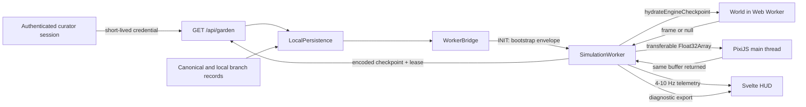

# Phase 3 Architecture Update: Remediation-Compatible Client

**Owner:** System Architect

**Package:** `@chaos-garden/client`

**Status:** Approved for merge — implemented and architecturally cleared in PR #4.

**Foundation:** Phase 2 remediation merged in PR #2

## 1. Decision and scope

Phase 3 delivers the browser terrarium: Svelte 5 UI, PixiJS v8 renderer, Web Audio soundscape, and a Web Worker-hosted simulation. It must be implemented on top of the remediated engine and shared contracts. The Phase 2 remediation is a fixed dependency, not a source of code to reimplement or simplify.

The original Phase 3 branch was created before Phase 2 remediation. The approved implementation preserves the remediated engine and shared contracts, including durable IDs, three-buffer backpressure, integrity-checked checkpoints, post-physics interaction correctness, and World-owned diagnostics. Client changes are additive around those contracts.

### In scope

- Web Worker orchestration and typed message bridge.
- PixiJS rendering, Svelte HUD, audio, visibility handling, and local persistence.
- Bootstrap from the canonical checkpoint envelope and optional lease-protected checkpoint submission.
- Client tests that exercise every Phase 2 integration seam.

### Out of scope

- Altering the 8-float render stride.
- Changing biology, trophic thresholds, ECS storage, snapshot codec, server authorization, or D1 concurrency rules.
- Moving simulation work, snapshot decoding, or diagnostics computation to the main thread.

## 2. Non-negotiable dependencies

| Contract | Authority | Client obligation |
| --- | --- | --- |
| Render frame | `World.getTransferableRenderFrame(): TransferableRenderFrame \| null` | Transfer a frame only when non-null; skipped frames retain the last rendered scene. Return the exact received buffer once rendering is complete. |
| Render stride | `@chaos-garden/shared` | Interpret exactly `[ID_HASH, X, Y, ROTATION, SIZE, TYPE_CODE, HEALTH_RATIO, ENERGY_RATIO]`; do not add metadata to the frame. |
| Entity identity | `World` / `ComponentStorage.entityIds` | Use immutable `entityId` for selection, inspection, and lineage. `idHash` remains render/visual lookup only and is not globally unique. |
| Checkpoint | `EncodedEngineCheckpoint` and `World.hydrateEngineCheckpoint()` | Prefer the encoded checkpoint. Do not decode, synthesize, or mutate state around the binary payload in client code. |
| Canonical bootstrap | `GardenBootstrapResponse` | Read `{ canonicalState, checkpoint?, events }`; a high-level canonical state is a display/fallback representation, not proof of exact continuation. |
| Diagnostics | `World.flightRecorder` | Request exported recorder diagnostics from the worker. Do not construct a second recorder or scan the engine state from the UI. |
| Canonical writes | Worker API / D1 lease validation | A browser may submit only a valid checkpoint with a current curator lease. Local brush actions remain sandbox actions until explicitly checkpointed. |

## 3. Architecture



### Thread ownership

The worker exclusively owns `World`, ECS arrays, PRNG state, binary checkpoint import/export, spatial/biology ticks, and the flight recorder. The main thread exclusively owns the DOM, Svelte state, PixiJS GPU calls, input event handling, and Web Audio graph.

No main-thread callback may retain a transferred render or soil buffer after it is returned. No message handler may rely on per-frame object construction. Svelte receives only telemetry pulses at 4–10 Hz; render frames never enter Svelte state.

## 4. Lifecycle and data flows

### 4.1 Bootstrap and offline fallback

1. `LocalPersistence` fetches `GET /api/garden` with a timeout and parses the outer API success envelope before reading its `GardenBootstrapResponse` payload.
2. On success it stores the complete canonical bootstrap record, including the encoded checkpoint, in IndexedDB.
3. On network failure it loads the newest valid canonical record or an explicitly selected local branch; it never silently substitutes one for the other.
4. `WorkerBridge.init` transfers one typed bootstrap candidate to `SimulationWorker`.
5. The worker constructs a *fresh candidate World* and calls `hydrateEngineCheckpoint(candidate.checkpoint)` when present. It promotes that World to the running World only after success.
6. On checkpoint rejection, it discards the candidate World and reports a typed failure. It may try an older cached canonical record or start a primordial World. A legacy canonical hydration path is non-exact, must use a fresh candidate World, and is allowed only for a documented migration version.

The client must not treat raw JSON component arrays, a UI-shaped garden response, or an ad hoc checksum as an exact snapshot. Checkpoint bytes and SHA-256 validation remain owned by the engine codec. A bootstrap outcome records whether continuation is `exact`, `legacy`, or `primordial` so the UI never represents a fallback as canonical continuation.

### 4.1.1 IndexedDB record and branch policy

Use separate object stores or namespaced keys for `canonical` and `localBranch` records. Every record contains `kind`, `capturedAtMs`, `baseCheckpointTick`, `baseCheckpointChecksum`, `codecVersion`, `bootstrapEnvelope`, and byte size. A local branch additionally has a generated `branchId` and user-visible label.

- A successful API bootstrap replaces only the canonical record.
- Autosave replaces only the active local-branch record; it never overwrites canonical data.
- Online startup always selects the API canonical record. Offline startup selects the newest valid canonical record unless the user explicitly chooses a local branch.
- Retain one canonical record and at most three local branches; evict oldest local branches first on quota failure. Store the encoded checkpoint envelope, not a JSON-only engine snapshot.

### 4.2 Simulation and render backpressure

`World.step()` advances regardless of renderer availability. After a step, the worker asks for a transferable frame:

```ts
const frame = world.getTransferableRenderFrame();
if (frame !== null) {
  postMessage({ type: 'RENDER_FRAME', ...frame }, [frame.buffer.buffer]);
}
```

The engine owns a fixed pool of three render buffers. `null` is normal backpressure, not an error, and must not allocate a replacement buffer, pause simulation, or retry in a tight loop. The renderer retains its last complete frame. Its completion path sends the same buffer through `RETURN_RENDER_BUFFER`; rejected returns are recorded as protocol violations and never admitted by the client.

Soil textures use a separate fixed pool and the same acquire-transfer-return discipline. Telemetry messages are ordinary, throttled objects and are never sent at render frequency.

### 4.3 Selection, inspection, and curator tools

Render frames retain `idHash` for the fixed stride. Picking uses `PICK_ENTITY_AT_WORLD_POSITION { requestId, x, y }`: the worker queries its current spatial data, selects the nearest eligible entity deterministically, and returns `PICK_RESULT { requestId, entityId | null }`. The UI then sends `SELECT_ENTITY { entityId }` and receives `ENTITY_VITALS`. Inspector and lineage UI show immutable ID and parent entity ID; they must never preserve a slot index or assume an `idHash` is unique.

Curator tools are split into two modes:

- **Sandbox actions:** water, nutrients, and spawning modify only the worker-local branch. Spawning must call a World-owned public spawn/factory API so it allocates the monotonic entity ID and records an origin parent. Client code must never call `pool.allocate()` plus `storage.initEntity()` directly.
- **Canonical checkpoint:** an explicitly authorized curator serializes `exportEngineCheckpoint()`, submits the resulting envelope with the lease ID, and handles rejection without changing local simulation state. The server remains the sole lease and monotonic-tick authority.

### 4.3.1 Curator trust and lease lifecycle

The browser must never contain `CURATOR_SECRET` or a reusable server credential. Canonical checkpointing requires an authenticated curator session and a short-lived, audience-bound credential issued by the server-side authentication boundary. The browser sends that credential only over HTTPS in the supported authorization header; it keeps it in memory, never IndexedDB or localStorage.

The client obtains or renews a lease from `POST /api/garden/lease` before checkpointing. It schedules renewal before expiry, stops checkpoint attempts when the page is hidden or authentication expires, and treats `401`, `403`, and `409` as terminal for the current attempt. A `409` stale-tick response requires a fresh canonical bootstrap and user-visible branch-resolution choice; it must not retry the same checkpoint. Checkpoint cadence is an explicit product setting and remains below the Phase 2 D1 write budget.

### 4.4 Snapshot and diagnostics requests

Autosave requests an encoded checkpoint envelope from the worker and stores it in the active local branch. It must not store a JSON-only canonical state as the sole recovery artifact. Diagnostics requests return an explicit export from `world.flightRecorder`; exported diagnostics may allocate because they are user-initiated and throttled.

## 5. Functional design

### Renderer

- Organisms use PixiJS batched rendering with no more than five organism draw calls at 2,000 entities.
- Soil is one dynamic texture and one shader draw call. Main-thread upload occurs only after a pooled soil transfer arrives.
- Atmospheric glow is a fullscreen pass; per-organism blur filters are prohibited.
- Camera pan, zoom, and follow are visual-only. They never write to the World.

### Svelte UI and audio

- Runes derive HUD state from telemetry pulses, not frames.
- Audio unlocks only after a user gesture; its modulation consumes pulse-level aggregates.
- Follow camera and inspector tolerate an entity disappearing between telemetry pulses.
- The cull control must issue a real, typed worker command or be omitted; clearing UI selection is not a simulation mutation.

### Power management

When the document becomes hidden, `VisibilityManager` requests 5 TPS, pauses the Pixi ticker, and suspends the audio context. On visibility, it restores the selected target TPS, ticker, and eligible audio state. Simulation remains worker-owned; no duplicate timer may be created during rapid visibility changes.

## 6. Required worker protocol additions

The client protocol must be updated as a coherent shared contract before implementation. Required semantics are:

| Message | Direction | Required behavior |
| --- | --- | --- |
| `INIT` | main → worker | Includes `{ requestId, bootstrapCandidate }`, not ambiguous `initialStateJson`; a new init cancels all earlier pending requests. |
| `BOOTSTRAP_STATUS` | worker → main | Echoes `requestId` and reports `exact`, `legacy`, or `primordial`, plus a safe failure code where applicable. |
| `RENDER_FRAME` / `RETURN_RENDER_BUFFER` | worker ↔ main | Uses only the fixed engine pool; no frame message is sent for `null`. |
| `PICK_ENTITY_AT_WORLD_POSITION` / `PICK_RESULT` | main ↔ worker | Echoes `requestId`; worker resolves visual pointer position to immutable `entityId` without changing the render stride. |
| `SELECT_ENTITY` / `ENTITY_VITALS` | main ↔ worker | Address by immutable entity ID. |
| `CURATOR_ACTION` | main → worker | Uses World-owned mutation APIs; action application is local until checkpointed. |
| `REQUEST_SNAPSHOT` / `SNAPSHOT_PAYLOAD` | main ↔ worker | Echoes `requestId`; only one checkpoint export may run at a time, with later autosaves coalesced. Payload is an encoded checkpoint envelope suitable for IndexedDB. |
| `REQUEST_DIAGNOSTICS` / `DIAGNOSTICS_PAYLOAD` | main ↔ worker | Echoes `requestId`; payload derives from the World-owned recorder. |

Use discriminated unions with strict payload types. Every request/response pair carries a monotonic request ID. `WorkerBridge` owns a pending-request map, timeout, rejection on worker error/termination, and cancellation on reinitialization; it must not use one mutable resolver per request category. Do not use `any`, JSON shape probing, or client-specific copies of shared checkpoint interfaces.

## 7. Implementation record

1. Rebased the client integration on the remediated Phase 2 engine and shared contracts.
2. Added typed bootstrap outcomes, canonical/local IndexedDB records, and atomic candidate-World fallback handling.
3. Preserved nullable render-frame backpressure and returned-buffer soil-pool lifecycle.
4. Added World-owned curator mutation APIs, worker-side spatial picking, and stable-entity-ID selection.
5. Added encoded checkpoint persistence plus in-memory curator lease acquisition, renewal, and checkpoint submission.
6. Added correlated WorkerBridge requests, coalesced checkpoint export, cancellation, and timeouts.
7. Connected Flight Recorder diagnostics to the HUD, audio, renderer, and curator UI.
8. Verified the completed design with type checks, client tests, live-mounted UI reactivity tests, 89.16% client coverage, and a production build.

## 8. Verification gates

### Automated

- Three in-flight render buffers cause the fourth publication to be skipped; world tick and PRNG continuation remain correct.
- A returned buffer is reused; duplicate, unknown, detached, and wrong-length buffers are rejected.
- Valid server and IndexedDB checkpoint envelopes hydrate bit-identically for 1,000 ticks.
- Corrupt byte, checksum mismatch, unsupported version, and capacity mismatch leave the running World unchanged, discard the candidate World, and produce a typed bootstrap fallback outcome.
- Curator spawning produces non-zero, monotonic immutable IDs and `parentEntityId = 0`; recycled slots do not alter historical parentage.
- Selection resolves a stable ID even if two entities share an `idHash`.
- API canonical and local autosave records cannot overwrite one another; offline branch resume requires explicit selection.
- Overlapping snapshot/diagnostic requests correlate correctly; reinitialization, timeout, and worker termination reject pending callers without leaks.
- A browser build contains no curator secret. Expired credentials, lease loss, and stale-tick responses prevent checkpoint retries and preserve the local branch.
- A hidden tab reaches 5 TPS and stops Pixi rendering; repeated visibility events create no duplicate loops.
- Offline API failure uses a cached valid envelope; no cache falls back to primordial generation.
- `npm run test:all`, `npm run type-check:all`, and `npm run audit:sim` pass from the rebased branch.

### Manual

- Chrome performance recording at 2,000 entities shows no growing render-buffer count or per-frame allocation sawtooth.
- With the renderer intentionally delayed, the simulation continues and the display keeps the last frame.
- Disconnect/reload restores from an IndexedDB checkpoint and continues deterministically.
- A non-lease holder cannot create a canonical checkpoint; a valid lease holder can, and a stale tick is rejected.

## 9. Architect acceptance checklist

- [x] No Phase 3 change modifies or reverts remediated engine/shared contracts without an approved architecture decision.
- [x] Worker owns all simulation, checkpoint, and recorder operations.
- [x] Renderer handles a `null` transferable frame as normal backpressure.
- [x] All user-facing identity and lineage use stable entity IDs.
- [x] Exact continuation only follows checksum-verified encoded checkpoint hydration.
- [x] Canonical persistence is lease-protected and monotonic.
- [x] Browser checkpoint authority uses short-lived authenticated credentials; no server secret is shipped to the client.
- [x] Canonical and local-branch cache records are separate and have explicit retention policy.
- [x] Worker RPC requests are correlated, bounded, and cancelled safely.
- [x] Hidden tabs throttle to 5 TPS and local cache recovery works.
- [x] The seven architect rubrics and all automated gates pass.
